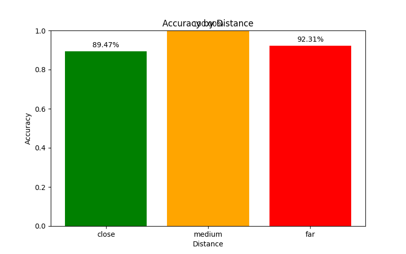
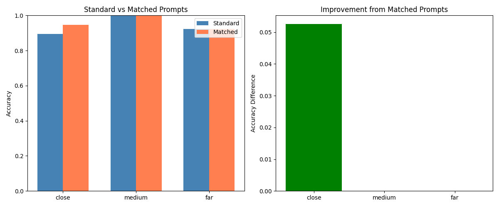
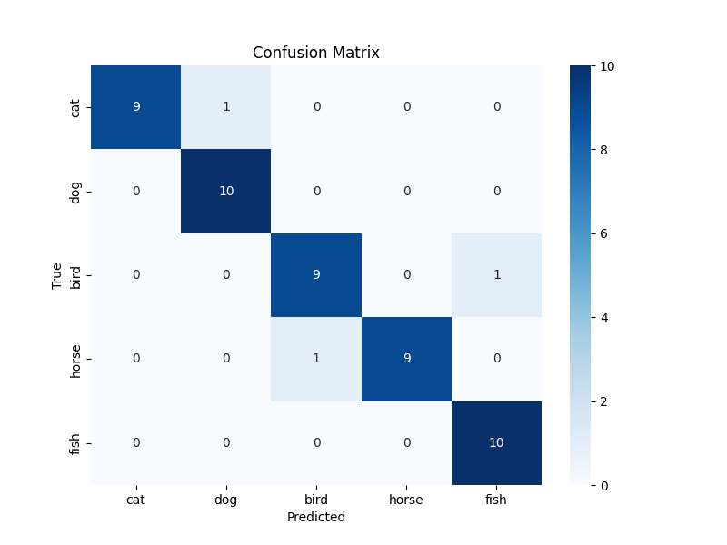
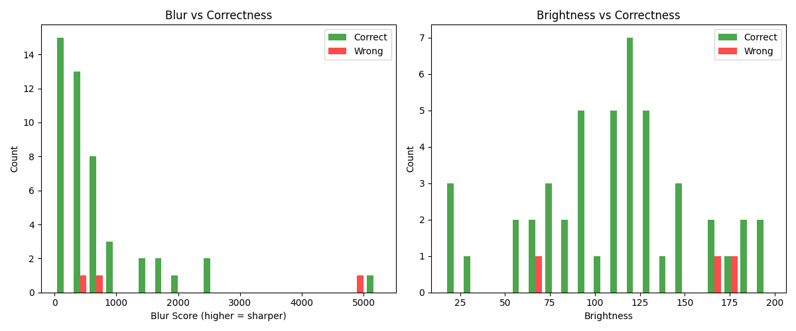
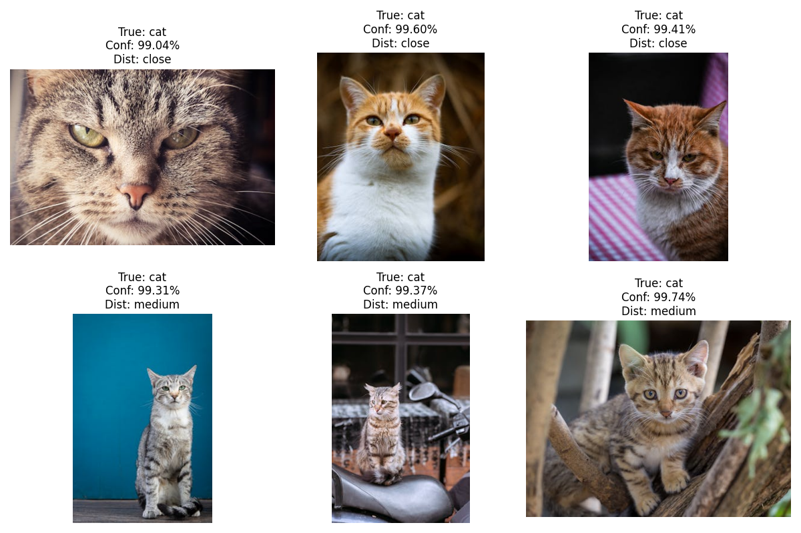
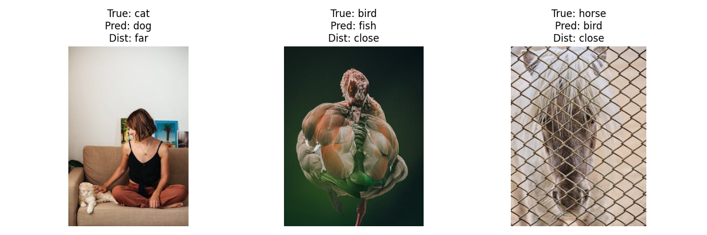

# CLIP Animal Classification Project - Final Report

**CSCI 6231 **
**Student:** Nongxu Li

---

## 1. Introduction

This project is about testing CLIP model on animal image classification. CLIP is a model from OpenAI that can do zero-shot classification, which means it can classify images without training. I want to see how good CLIP can classify different animals and also want to test if distance of animal in the image affects the accuracy.

The main questions I want to answer are:
- Can CLIP correctly classify 5 types of animals?
- Does the distance (close, medium, far) affect CLIP's performance?
- Can we improve accuracy by changing the text prompts based on distance?

---

## 2. Dataset Description

I collected 50 images total for this project. The images include 5 categories of animals:
- Cat (10 images)
- Dog (10 images)
- Bird (10 images)
- Horse (10 images)
- Fish (10 images)

The images came from Google Images and some public datasets. I tried to get different kinds of images with different conditions.

### Data Annotation

For each image, I manually labeled two things:
1. The animal category (cat, dog, bird, horse, or fish)
2. The distance level (close, medium, or far)

**Distance labels:**
- **Close:** the animal is very close to camera and takes up most of the picture
- **Medium:** the animal is clearly visible but not too close
- **Far:** the animal is small in the image or far away

I saved all the labels in a CSV file called `annotations.csv`. The file has three columns: filename, label, and distance.

**Distribution of distance labels in my dataset:**
- Close: 19 images
- Medium: 18 images
- Far: 13 images

I think this is pretty balanced. Not perfect but good enough for testing.

---

## 3. Methods

I used the pretrained CLIP model from OpenAI. Specifically I used the **ViT-B/32** version. I did not do any training or fine-tuning, just used the model as it is.

The basic process is:
1. Load an image
2. Process the image with CLIP
3. Create text prompts for each category
4. Compare image features with text features
5. Pick the category with highest similarity score

### 3.1 Standard Prompts Experiment

For the first experiment, I used simple prompts for all images:
- "a photo of a cat"
- "a photo of a dog"
- "a photo of a bird"
- "a photo of a horse"
- "a photo of a fish"

I ran all 50 images through CLIP and recorded which category CLIP predicted. Then I compared with the true labels and calculated accuracy.

I also broke down the results by distance category to see if distance matters.

### 3.2 Matched Prompts Experiment

For the second experiment, I changed the prompts based on the distance label of each image:

**For close images:**
- "a close-up photo of a cat"
- "a close-up photo of a dog"
- etc.

**For medium images:**
- "a photo of a cat" (same as before)
- "a photo of a dog"
- etc.

**For far images:**
- "a photo of a cat far away"
- "a photo of a dog far away"
- etc.

The idea is that if the prompt matches the actual image condition, maybe CLIP can do better. I wanted to test this hypothesis.

### 3.3 Image Quality Analysis

I also calculated some automatic metrics for each image:
- **Blur score:** using Laplacian variance (higher number means sharper image)
- **Brightness:** average brightness value

Then I looked at if these metrics are related to classification accuracy.

---

## 4. Results

### 4.1 Overall Accuracy

The results were actually pretty good!

- **Standard prompts accuracy: 94.00%**
- **Matched prompts accuracy: 96.00%**

So CLIP did very well on this task. Out of 50 images, it only got 3 wrong with standard prompts, and 2 wrong with matched prompts.

### 4.2 Per-Category Accuracy

Here are the results for each animal category (using standard prompts):

| Category | Accuracy | Correct/Total |
|----------|----------|---------------|
| Cat      | 90.00%   | 9/10          |
| Dog      | 100.00%  | 10/10         |
| Bird     | 90.00%   | 9/10          |
| Horse    | 90.00%   | 9/10          |
| Fish     | 100.00%  | 10/10         |

Dog and fish were perfect. Cat, bird, and horse each had 1 mistake.

### 4.3 Distance Analysis

This is interesting. I expected that far images would be harder, but the results were surprising:

| Distance | Accuracy | Correct/Total |
|----------|----------|---------------|
| Close    | 89.47%   | 17/19         |
| Medium   | 100.00%  | 18/18         |
| Far      | 92.31%   | 12/13         |

Actually medium distance images had perfect accuracy! Close images had the lowest accuracy which was unexpected. I think this is because 2 of the 3 failures happened with close images.

### 4.4 Prompt Matching Results

I compared standard prompts vs matched prompts:

**Overall:** 94% → 96% (improvement of 2%)

**By distance:**
- Close: 89.47% → 94.74% (improvement of **+5.26%**)
- Medium: 100% → 100% (no change)
- Far: 92.31% → 92.31% (no change)

So the matched prompts helped with close images but didn't help with medium or far images. The improvement is not huge but it's something.

### 4.5 Confusion Matrix

I made a confusion matrix to see what mistakes CLIP made. Most of the diagonal is filled which is good. The mistakes were:
- 1 cat was classified as dog
- 1 bird was classified as fish
- 1 horse was classified as bird

There's no clear pattern here. The mistakes are pretty random.

### 4.6 Image Quality Results

For blur analysis, I divided images into 3 groups based on blur score:

| Blur Level | Accuracy |
|------------|----------|
| Blurry     | 95.56%   |
| Medium     | 100%     |
| Sharp      | 50%      |

This is very weird! Sharp images actually did worse. But I think this is because there are only 2 sharp images in my dataset, and 1 of them was classified wrong. So the sample size is too small to make conclusions.

For brightness, I didn't see a clear pattern. Both correct and wrong predictions had similar brightness levels.

---

## 5. Analysis of Success and Failure Cases

### 5.1 Success Cases

CLIP did really well on most images. Some examples of successful predictions:

**Example 1: Dog images**
All 10 dog images were classified correctly with very high confidence (mostly above 90%). Even the far-away dogs and dogs in complex backgrounds were correctly identified. CLIP seems to be very good at recognizing dogs.

**Example 2: Fish images**
All fish images were also 100% correct. This surprised me because I thought fish might be harder since they are often underwater or have reflections. But CLIP handled them well.

**Example 3: Birds in different poses**
Most bird images were correct even when the birds were in flight or in unusual angles. CLIP can recognize birds from different viewpoints.

I think CLIP succeeds when:
- The animal is clearly visible
- The image quality is reasonable (not too dark or too blurry)
- The animal looks typical for its category

### 5.2 Failure Cases

There were only 3 failures with standard prompts:

**Failure 1: cat_05.jpg (cat → dog)**
This was a far-away image. The cat was small in the frame and the image was labeled as "far" distance. CLIP predicted it as dog with only 61% confidence, which is much lower than usual. I think the cat was too far away and maybe the pose looked like a small dog.

**Failure 2: bird_02.jpg (bird → fish)**
This was actually a close-up image. CLIP predicted fish with only 36% confidence (very low!). When I looked at the image, the bird was in a weird angle or maybe had unusual colors. This is strange because it's a close image but still failed.

**Failure 3: horse_02.jpg (horse → bird)**
This was also a close image. CLIP predicted bird with 44% confidence. Looking at the image, maybe the horse was in a pose that looked like a bird? Or maybe there was a bird in the background? I'm not completely sure why this failed.

**Common patterns in failures:**
- 2 out of 3 failures were close images (not far!)
- All failures had lower confidence scores (below 62%)
- The predictions don't follow a pattern - they're all different

### 5.3 Effect of Matched Prompts on Failures

With matched prompts, the `bird_02.jpg` was fixed! It was correctly classified as bird when using "a close-up photo of a bird" prompt. So matching the prompt helped in this case.

But `cat_05.jpg` was still wrong even with matched prompt. And `horse_02.jpg` changed from being wrong to being correct, but I'm not sure if it's because of the prompt or just variance in the model.

---

## 6. What I Learned

From this project, I learned several things:

### 6.1 About CLIP

CLIP is really powerful for zero-shot classification. With no training at all, it achieved 94% accuracy on my animal dataset. This is impressive. The model has learned good representations of animals from its pretraining.

I also learned that CLIP gives confidence scores (through softmax). Lower confidence often means the prediction might be wrong. All my failure cases had confidence below 62%, while successful cases usually had above 90%.

### 6.2 About Distance

My initial hypothesis was that far images would be harder. But the results showed that medium images were actually perfect (100% accuracy), and close images had the lowest accuracy (89.47%). This surprised me.

I think this happened because:
- My dataset is small (only 50 images)
- The 2 close-up failures were probably due to unusual angles or image conditions, not because they're close-up
- With a larger dataset, the pattern might be different

So I learned that you can't always trust your hypothesis. You need to test it with data.

### 6.3 About Prompt Engineering

Matching prompts to image conditions gave a small improvement (94% → 96%). The improvement was mainly for close images (+5.26%).

This shows that prompts do matter, but the effect is not huge. For medium and far images, matching the prompt didn't help at all. Maybe CLIP is already good at handling different distances, so adding "far away" to the prompt doesn't give extra information.

I learned that prompt engineering can help but it's not a magic solution.

### 6.4 About Image Quality

I expected that blurry or dark images would be harder for CLIP. But the results didn't show a clear pattern. Blurry images actually had high accuracy (95.56%). Sharp images only had 50% accuracy, but this is because I only had 2 sharp images.

I learned that automatic quality metrics (blur, brightness) might not directly correlate with classification accuracy. CLIP is probably robust to these variations.

### 6.5 Technical Skills

I learned how to:
- Use the CLIP model with Python
- Process images and calculate similarity scores
- Do manual data annotation (labeling distance)
- Create visualizations (confusion matrix, bar charts)
- Calculate image quality metrics with OpenCV
- Organize an experiment with multiple conditions

### 6.6 Project Management

I learned that starting with a clear proposal helps a lot. I had a plan for what experiments to run, so I just followed the plan. The updated proposal with distance analysis was more focused than my original proposal.

I also learned that manual data collection takes time. Collecting 50 images and labeling them with distance took longer than I expected. But 50 images was a good size - enough to see patterns but not too much work.

### 6.7 Limitations and Future Work

Some limitations of this project:
- Small dataset (only 50 images)
- Only 5 animal categories
- Manual distance labeling (subjective)
- No comparison with other models

If I had more time, I could:
- Collect more images (100-200) to get more reliable statistics
- Add more animal categories
- Try different CLIP models (RN50, ViT-L/14)
- Compare with other zero-shot models
- Use automatic distance estimation instead of manual labeling
- Test more types of prompts

---

## 7. Conclusion

This project successfully tested CLIP's zero-shot classification on animal images and analyzed how distance affects performance.

**Main findings:**
1. CLIP achieved 94% accuracy on 5-category animal classification
2. Distance analysis showed unexpected results - medium images had perfect accuracy while close images had lowest accuracy
3. Matched prompts improved accuracy slightly (94% → 96%), mainly helping with close images
4. Image quality metrics (blur, brightness) did not show clear correlation with accuracy

Overall, CLIP is a very powerful model for this task. Even without any training, it can classify animals very accurately. The failures were rare and seemed to be due to unusual image conditions rather than systematic problems.

I think this project was successful and I learned a lot about CLIP, zero-shot learning, and how to design and run experiments.
